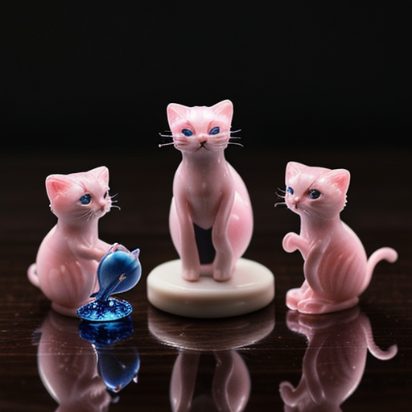

## 1.0 Introduction

After experiment with the Automatic 1111 workflow was the Comfy UI workflow.
The model I think was _td/sd1.5/dreamshaper_8.safetensors

The first prompt was tried:

>three tiny glass cats, pink marble, macro photography, on a flat table

The second prompt was tried:

>three tiny glass cats, pink marble, with small blue glass fish, macro photography, on a flat dark wood table

One of them was the blue colour but no fish was added. [Regional prompt](https://stable-diffusion-art.com/regional-prompter/) apparently is used to work with this.

A different model was used to be more realistic style:

Upscaling the image from 512^2 to 1024^2 after generation using bicubic, but did not add any detail, not using model for upscaling:

An upscaling with a model can add detail:

Diferent model can have better ideal to fill in the for prompt including "owl-fish"

>majestic white owl-fish with wings flying over mountain landscape, painting, masterpiece

The realistic vision type models to not like very much the style prompts. Image size was also changed to be 512x768

>majestic white owl-fish with wings flying over mountain landscape, painting, masterpiece, van gho painting

## 2.0 Image size and keyword strength, workflow with multiple output

ComfyUI makes it easier to compare the result of images at the time they are generated, at the same time. The similar effect as before was seen with the amount of strength of keyword adjusted for example (realistic water:1.3), the repetitive pattern shows more when it is too much (1.7 for example)

These example were from the darksushimixmix model:

From realistic vision again:

## 4.0 References:

